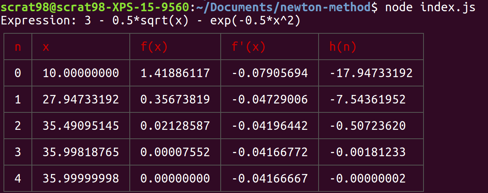

## Отчет по лабораторной работе №2

## Решение нелинейных уравнений методом Ньютона

### Головко Артем М3209 <br> Вариант 7

---

### Напишем функцию на JavaScript для итерационного процесса Ньютона.

```javascript
const math = require("mathjs");
const log_table = require("cli-table");

function newtonMethod(func, derivativeFunc, initialX, epsilon, dgt, maxIter) {
  const result = new log_table({
    head: ["n", "x", "f(x)", "f'(x)", "h(n)"]
  });

  let curX = initialX;
  for (let i = 0; i < maxIter; i++) {
    const funcVal = func(curX);
    const derivativeFuncVal = derivativeFunc(curX);
    const hVal = math.divide(funcVal, derivativeFuncVal);

    result.push([
      `${i}`,
      `${math.format(curX, { notation: "fixed", precision: dgt })}`,
      `${math.format(funcVal, { notation: "fixed", precision: dgt })}`,
      `${math.format(derivativeFuncVal, {
        notation: "fixed",
        precision: dgt
      })}`,
      `${math.format(hVal, { notation: "fixed", precision: dgt })}`
    ]);

    if (Math.abs(hVal) < epsilon) break;
    curX = math.subtract(curX, hVal);
  }

  return result;
}
```

### Теперь зададим константы и вызовем наш метод Ньютона

эпсилон (epsilon) = 10<sup>6</sup> <br>
количество знаков после запятой (dgt) = 8 <br>
максимальное количество итераций (maxIter) = 50 <br>
найдем X<sub>0</sub> (initialX) = 10 <br>
зададим само выражение(expr) = %20-%20exp(-0.5*x^2))

```javascript
function evalToFunc(originalEval) {
  return val => originalEval({ x: val });
}

const epsilon = 1e-6;
const dgt = 8;
const maxIter = 50;
const initialX = 10;
const expr = "3 - 0.5*sqrt(x) - exp(-0.5*x^2)";

const func = evalToFunc(math.parse(expr).compile().eval);
const derivativeFunc = evalToFunc(math.derivative(expr, "x").compile().eval);
const result = newtonMethod(
  func,
  derivativeFunc,
  initialX,
  epsilon,
  dgt,
  maxIter
);

console.log(`Expression: ${expr}`);
console.log(result.toString());
```

### В итоге получим таблицу с результатом:


